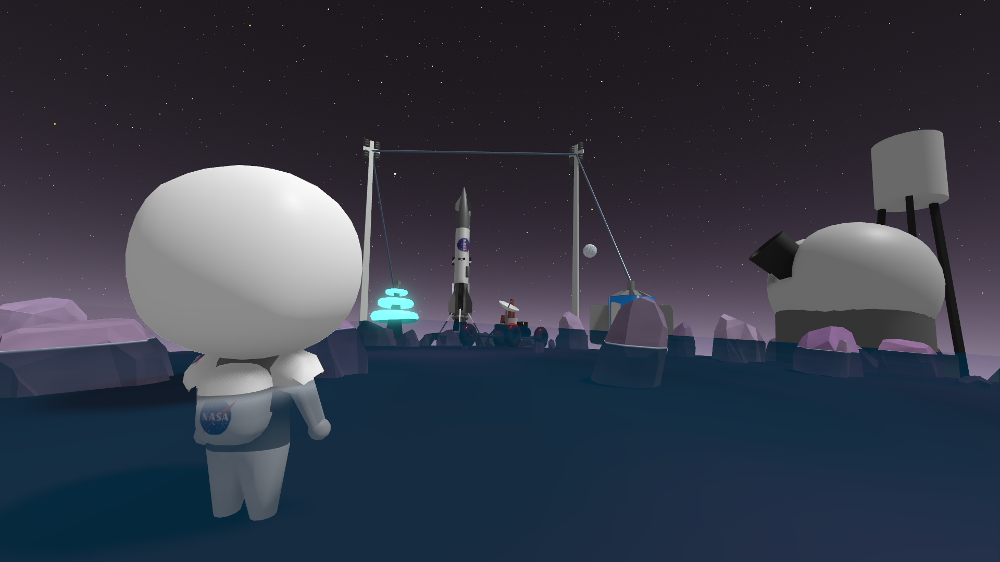
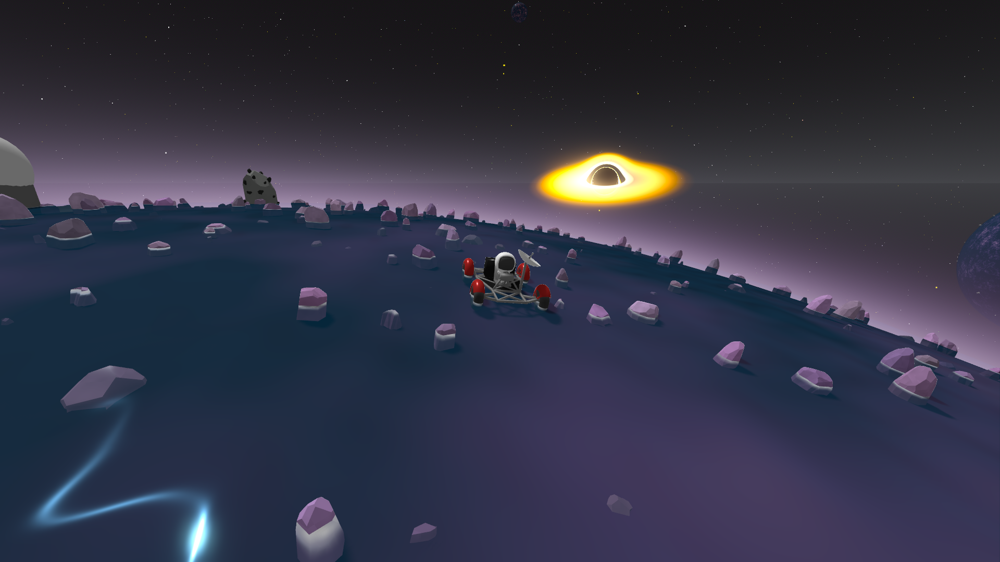
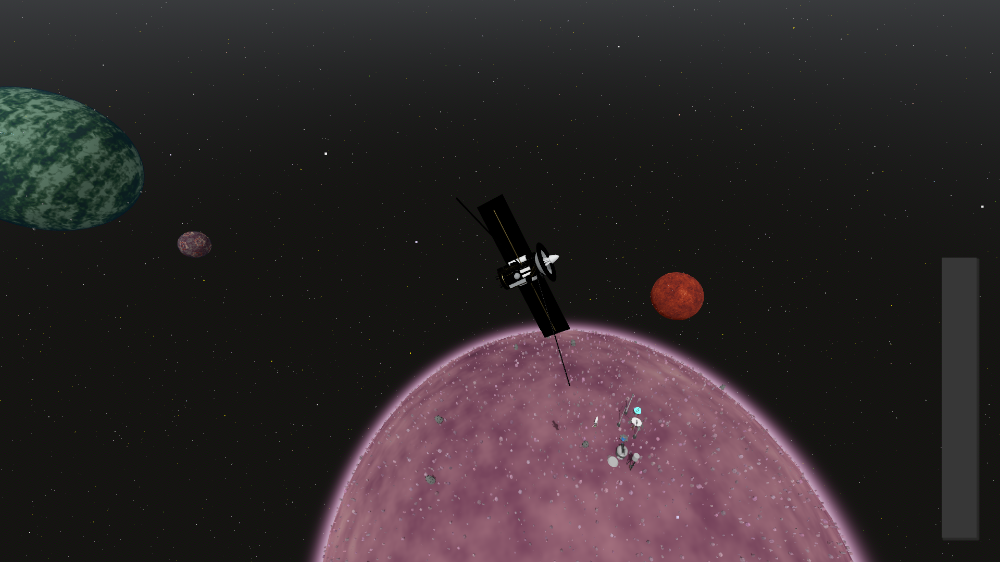

# Into the Cosmos

*A KSP and Spaceflight Simulator inspired sandbox game about realistic space travel, built for people who just want to relax and enjoy flying through space.*

  

[Click here to watch the gameplay video on YouTube](https://youtu.be/ZZg3blASmgc) |
[Click here to view all the devlogs related to this project](https://stardance.hackclub.com/projects/25109)

## Download

Download the latest release from the GitHub Releases page and launch the executable.

> **Note:** The current release has well documented controls and instructions on how to get your spacecraft into orbit. If you're new, you can also press **ESC** to open the Settings menu and enable the on-screen keybind guide.

[Click here to play the web version instead](https://tejaswa7692.itch.io/into-the-cosmos)

> **Important:** The web version has major bugs, looks worse, and has some UI issues. I **highly recommend playing the downloadable version** since it doesn't have these issues.

---

# About

Into the Cosmos is a KSP and Spaceflight Simulator inspired game about realistic space travel.

I made this game to be a fun sandbox project where you don't need to spend hours building, tweaking, and tinkering with your rocket just for it to fail at the last moment.

Instead, the focus is on flying, exploring, building, and experiencing space.

The game features an effectively infinite procedurally generated universe filled with unique planets waiting to be discovered. Every planet is generated procedurally, so theres no real limit to the size of the universe.

This game also has **farlands**. If you go far enough, you'll eventually start experiencing some very weird stuff.

As you explore, you can land on planets, build observatories, deploy rovers, gather scraps, refine materials, generate electricity, upgrade your rockets, and continue venturing farther into the universe.

Every planet also has its own properties, so not every planet is exactly the same.

This game was made to be something someone can open after a long day of school or work and just chill out and fly around space from the comfort of their couch.

This project was made in **Godot 4.6.2** as my submission for **Hack Club Stardance**. It is a realistic physics simulation of space bodies and how spacecraft have to move in order to successfully reach orbit.

---

  

# Quick Start

1. Download the latest release.
2. Launch the executable.
3. Read the controls and instructions.
4. Press **ESC** to open the Settings menu if you want to enable the on-screen controls guide.
5. Build your spacecraft.
6. Launch your rocket.
7. Deploy your satellite or land on a planet.
8. Build an observatory.
9. Explore the universe.
10. Build rovers, collect scraps, refine materials, generate electricity and upgrade your spacecraft.

---

  

# How It Works

The game simulates realistic gravity and orbital mechanics, meaning you have to launch and maneuver your spacecraft somewhat like you would in real life if you wanted to successfully reach orbit.

Both the rocket and satellite have their own RCS controls, allowing you to orient yourself and perform orbital corrections after deployment.

## Procedural Universe

The universe is procedurally generated, allowing you to travel through an effectively infinite number of unique planets.

Every planet can be explored, landed on, and **used as a stepping stone for your next adventure.**

Planets also have their own properties, which makes different planets feel a bit more unique instead of everything being the exact same.

And if you travel far enough, you can reach the **farlands**.

I don't really know why you'd want to go there, but you can.

## Building & Rocket Upgrades

The game now has a **proper build menu** for building and configuring spacecraft.

I've also added **rocket upgrades**, allowing you to improve your spacecraft as you progress and make longer missions possible.

The goal is still to keep building relatively simple. I don't want this to turn into a game where you spend 3 hours designing a rocket before getting to actually fly it.

## Electricity

Electricity has now been added to the game.

In future a LOT will be added trust for now only rocket upgrades require electricity but in future ships almost everything will

## Materials, Scraps & Refining

There is now a basic material processing system in the game.

You can find **scraps** while exploring and use **scrap refining** to turn them into useful materials.

These materials can then be used for different things around your spacecraft and planetary operations.

## Rovers

You can now deploy **rovers** on planets and actually explore the surface instead of only looking at it from your spacecraft.

Rovers give you another way to explore planets and find things while you're down there.

## Observatories

You can construct observatories on planets throughout the universe.

These observatories act as exploration outposts, allowing you to mark your existance on planets.

Landing your rocket on an observatory's landing pad allows you to interact with it and completely refuel your spacecraft before heading back into space.

## Mudfish

Mudfish are a completely unrelated thing that I added because I thought it would be funny.

They are basically **stupid fish that walk on land**.

That's it.

They're just a random entity that exists in the game.

I don't really have a deep explanation for why they exist.

They're just Mudfish.

## Visuals & Ambiance

There are custom raymarched **nebula and black hole shaders**, along with improved ambiance and planetary visuals.

Also every planet has **atmospher** now and their colors are set by their unique properties that each planet has for example temp air pressure and gravity and more in future these will have a major affect on gameplay

The game also has a full Settings menu where you can change graphics, display options and gameplay settings.

Settings are automatically saved between sessions.

---

  

# Development

This project started as an experiment in realistic orbital mechanics and slowly turned into a much bigger space exploration game.

Over the course of development I kept redesigning and improving existing systems while adding things like procedural planets, observatories, spacecraft building, rocket upgrades, electricity, material processing, scraps, scrap refining, planetary properties, rovers, new shaders, graphics settings, configuration saving, better controls and a bunch of other stuff.

A lot of time was also spent trying to optimize the game.

I tried to optimize pretty much everything I could within the time I had, rewriting parts of the project and trying different approaches to improve performance without completely destroying the visuals.

The project has changed quite a lot from what it originally was, but the main idea has stayed the same:

**I just wanted to make a game where you can fly around space and have fun without the game getting in your way.**

---

# Future

This is only the beginning for Into the Cosmos.

Some of the things I might add in the future:

* Research systems
* More resource gathering
* More spacecraft
* Space stations
* More exploration mechanics
* More electricity systems
* More visual effects
* More procedural content
* More things to discover throughout the universe **(IMPORTANT)**
* More stuff for rovers to do
* Probably more stupid entities

---

# Credits

**Engine**

* Godot 4.6.2

**Models and Assets**

* Blender

**External Assets**

Satellite 3D Model

https://sketchfab.com/3d-models/sattelite-c6048c0a71064df3b1cc0ddef2f3ae6a

---

Thank you for checking out my game. I hope you have as much fun exploring the universe as I had building it.
